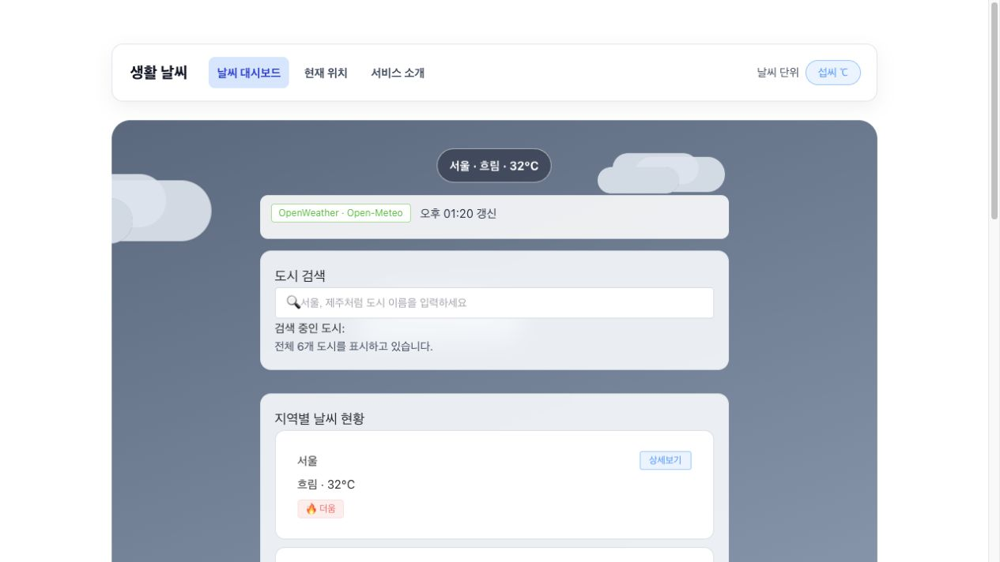
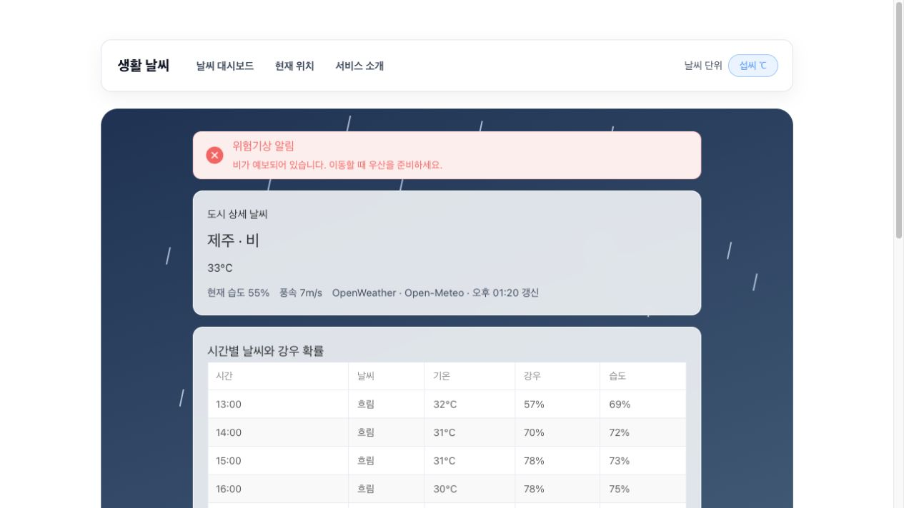

# 과제에 앞서..

안녕하세요, 개인 기능에 정말 고민을 많이 했습니다. 기능이 매우 실용적입니다!
먼저 혼자 사는 사람들이라면 공감할 만할 산책, 빨래 최적 시간 추천 기능입니다. 강우 확률, 습도, 기온, 미세먼지를 고려해 최적 시간을 산출해줍니다. 특히 1인가구는 베란다 혹은 건조기가 없어 빨래 타이밍이 중요하므로 효율적인 기능일 것 같습니다
두 번째로 현재 위치 찾기 기능입니다. 현재 위치를 찾고 앞으로 6시간 동안 날씨를 나타내 야외 외출 시에도 날씨를 빠르게 파악할 수 있습니다.
마지막으로 화면 구성입니다. 날씨에 따라 햇살, 구름, 비, 눈, 태풍 효과가 바뀌는 화면으로 굉장히 직관적으로 날씨를 파악할 수 있어 매우 실용적입니다.


# 프로젝트명

Vue 수업에서 배운 문법을 날씨 화면에 단계별로 적용하는 프로젝트입니다.
처음부터 완성된 앱을 한 번에 만들지 않고 Mockup, Composition API, Component, Router, Pinia, Axios 순서로 같은 화면을 확장하면서 각 단계의 차이를 확인하며 진행했습니다.

현재는 **8단계 품질 관리와 GitHub Pages 배포**까지 완료했습니다. 저장소와 배포 주소에서 실제 화면을 확인했습니다.

## 제출 링크

- GitHub 저장소: [minkyu-huh/skala-weather-assignment](https://github.com/minkyu-huh/skala-weather-assignment)
- 배포 주소: [생활 날씨 대시보드](https://minkyu-huh.github.io/skala-weather-assignment/)

## 실행 화면

### 메인 날씨 대시보드



### 제주 상세 날씨



## 프로젝트에서 만들고 싶은 기능

- 날씨에 따라 햇살, 구름, 비, 눈, 태풍 효과가 바뀌는 화면
- 시간별 날씨와 강우 확률을 이용한 산책 추천
- 강우 확률과 습도를 이용한 빨래 추천
- 비, 눈, 태풍 등 위험기상 경고
- 현재 위치를 이용한 날씨 조회
- 미세먼지와 초미세먼지 정보 표시

- 1~5단계 연습 파일: 가짜 날씨 데이터(Mock) 사용
- 최종 실행 화면: Axios로 실제 날씨 API 사용
- 특정 도시의 API 요청이 실패하면: 그 도시만 임시 Mock 데이터로 표시해서 전체 화면이 망가지지 않게 처리

## 진행 단계

| 단계 | 내용 | 상태 |
| --- | --- | --- |
| 1 | Weather Mockup | 완료 |
| 2 | Composition API | 완료 |
| 3 | Component 분리 | 완료 |
| 4 | Vue Router | 완료 |
| 5 | Pinia Store | 완료 |
| 6 | Axios와 실제 날씨 API | 완료 |
| 7 | Element Plus와 최종 UI | 완료 |
| 8 | 품질 관리와 GitHub Pages 배포 | 완료 |

## 1단계: Weather Mockup

교수님이 제공한 WeatherMockup.vue를 과제 폴더로 복사해 시작했으며, 원본 파일은 그대로 두고 단계별 파일을 만들어 기능을 확장했습니다.

### 구현한 내용

- `ref`로 서울, 수원, 부산, 제주, 인천, 광주의 Mock 날씨 배열을 만들었습니다.
- `v-for`로 도시 카드를 반복해서 출력하고 도시 ID를 `:key`로 사용했습니다.
- `v-if`와 `v-else`로 25도 이상과 미만의 안내 배지를 구분했습니다.
- `:value`와 `@input`을 사용해 입력한 한글 도시 이름이 바로 화면에 나타나게 했습니다.
- 날씨 카드를 누르면 선택한 도시의 이름, 날씨, 기온이 화면 위에 표시되도록 했습니다.
- 상세보기 버튼에는 `@click.stop`을 사용해 카드 선택 이벤트까지 같이 실행되지 않도록 했습니다.

### 개인 기능

- 교수님 예제에 있던 서울, 수원, 부산 외에 제주, 인천, 광주 데이터를 추가했습니다.
- 도시마다 `theme` 값을 함께 넣고 카드를 클릭했을 때 이 값에 맞는 장면을 보여주도록 했습니다.

| 날씨 | 화면 효과 |
| --- | --- |
| 맑음 | 햇살과 회전하는 빛줄기 |
| 흐림 | 화면을 가로질러 움직이는 구름 |
| 비 | 위에서 아래로 떨어지는 빗방울 |
| 눈 | 속도와 크기가 다른 눈송이 |
| 태풍 | 어두운 배경, 먹구름, 비, 번개 |

처음에는 단순히 배경색만 바꾸는 것도 생각했지만, 날씨 앱을 열었을 때 현재 상태가 바로 느껴지는 화면을 만들고 싶어서 움직이는 날씨 장면을 추가했습니다. 효과가 버튼 클릭을 방해하면 안 된다고 생각해 날씨 레이어에는 `pointer-events: none`을 적용했습니다.

### 사용한 문법과 적용 이유

`v-for`는 배열의 각 데이터를 같은 화면 구조로 반복해서 만들 때 사용하는 문법이라고 이해했습니다. 서울, 수원, 부산뿐 아니라 제주, 인천, 광주를 추가하더라도 카드 HTML을 도시 수만큼 복사하지 않는 편이 수정하기 쉽다고 생각했습니다. 그래서 개인 도시 데이터와 비·눈 입자를 `v-for`로 출력했습니다. 도시에는 배열 순서 대신 고유한 `id`를 `:key`로 사용했고, 입자에도 각각의 ID를 지정했습니다.

`v-if`는 조건에 따라 실제로 필요한 요소만 화면에 만들거나 제거하는 문법입니다. 날씨 장면은 맑을 때 햇살, 흐릴 때 구름, 비가 올 때 빗방울처럼 서로 다른 요소가 필요합니다. 모든 효과를 한꺼번에 만든 뒤 CSS로 숨기는 것보다 선택한 도시의 `theme`에 해당하는 효과만 렌더링하는 것이 이 기능에 어울린다고 판단하여 `v-if`를 적용했습니다. 온도 배지도 같은 방식으로 25도 이상과 미만을 구분했습니다.

이벤트는 사용자의 행동을 데이터 변경으로 연결하는 기능이라고 이해했습니다. 검색창의 `@input`은 입력값을 `searchQuery`에 저장하고, 카드의 `@click`은 선택한 도시 객체를 `selectedWeather`에 저장합니다. 선택 데이터가 바뀌면 `theme`도 함께 바뀌기 때문에 클릭 한 번으로 배경과 날씨 애니메이션이 전환됩니다. 상세보기 버튼은 카드 안에 있으므로 클릭 이벤트가 부모 카드까지 전달되는 문제가 생길 수 있다고 생각해 `@click.stop`을 사용했습니다.

1단계에서는 검색어를 입력받아 화면에 표시하는 데까지만 구현했습니다. 목록 필터링까지 일반 함수로 미리 만들면 2단계의 `computed`를 사용해야 하는 이유가 잘 보이지 않을 것 같았습니다. 따라서 검색 결과 계산은 2단계에서 확장하도록 구분했습니다.

## 2단계: Composition API

1단계 결과를 남겨 두기 위해 `WeatherMockup.vue`를 `WeatherComposition.vue`로 복사한 후 기능을 확장했습니다. 같은 화면을 두고 로직을 추가하니 기본 Mockup과 Composition API를 적용한 결과를 바로 비교할 수 있었습니다.

### 구현한 내용

- 검색어를 앞뒤 공백 제거 후 도시 이름과 비교하는 `filteredWeatherList`를 작성했습니다.
- 검색 결과가 없으면 별도의 안내 문구가 나타나도록 했습니다.
- 선택 도시 ID를 기준으로 시간별 Mock 예보를 가져오는 `selectedHourlyForecast`를 작성했습니다.
- 날씨의 `theme` 값으로 화면 클래스를 만드는 `weatherSceneClass`를 작성했습니다.
- `watch`로 선택 도시를 감시해 이전 도시와 새 도시가 포함된 장면·추천 갱신 문구를 표시했습니다.
- `watchEffect`로 검색어와 검색 결과 개수를 추적해 검색 상태 안내문을 표시했습니다.

### 산책·빨래 추천 계산

산책은 강우 확률 30% 이하, 미세먼지 80 이하, 초미세먼지 35 이하, 기온 8~28도인 시간을 후보로 정했습니다. 후보가 여러 개면 22도에 가장 가까운 시간을 선택했습니다.

빨래는 강우 확률 20% 이하, 습도 65% 이하이며 비·눈·태풍이 아닌 시간을 후보로 정했습니다. 후보가 여러 개면 습도가 가장 낮은 시간을 선택했습니다.

제주처럼 모든 시간대에 태풍과 비가 예보된 Mock 데이터에서는 억지로 시간을 추천하지 않고, 오늘은 권장하지 않는다는 문구를 보여주도록 했습니다.

### 사용한 문법과 적용 이유

`ref`는 값이 바뀌면 화면도 함께 갱신되는 반응형 상태를 만들 때 사용하는 기능이라고 이해했습니다. 검색어와 선택 도시는 사용자의 입력과 클릭에 따라 직접 바뀌는 원본 상태이므로 `searchQuery`와 `selectedWeather`를 `ref`로 관리했습니다. 시간별 Mock 예보도 나중에 API 응답으로 교체될 데이터라고 생각해 반응형 상태로 만들었습니다.

`computed`는 기존 반응형 데이터를 이용해 새로운 결과를 계산하고, 의존하는 값이 바뀔 때 다시 계산하는 기능입니다. 산책 추천은 선택 도시의 기온, 강우 확률, 미세먼지, 초미세먼지를 조합해야 하고 빨래 추천은 강우 확률과 습도를 조합해야 합니다. 별도의 결과 값을 직접 수정하는 것보다 날씨 데이터에서 항상 같은 기준으로 계산되는 기능이므로 `computed`가 어울린다고 생각했습니다. 도시가 바뀌면 시간별 예보와 추천 결과가 연속해서 다시 계산되도록 구성했습니다.

`watch`는 특정 반응형 값 하나의 이전 값과 변경된 값을 비교하면서 후속 작업을 실행할 때 적합하다고 이해했습니다. 사용자가 도시 카드를 누른 뒤 어느 도시에서 어느 도시로 변경했는지 알려주고, 장면과 생활 추천이 갱신됐다는 문구를 남기는 기능에 적용했습니다. 처음에는 선택 함수에서 안내 문구까지 함께 변경했지만, 도시 상태를 감시하는 역할을 분리하는 편이 `watch`의 사용 목적을 설명하기 좋다고 판단했습니다.

`watchEffect`는 함수 안에서 사용한 여러 반응형 값을 자동으로 추적하는 기능입니다. 검색 상태 문구는 `searchQuery`와 `filteredWeatherList`의 개수를 동시에 사용하므로 감시 대상을 하나씩 지정하는 `watch`보다 `watchEffect`가 어울린다고 판단했습니다. 검색어가 없을 때는 전체 도시 수, 결과가 있을 때는 검색 개수, 없을 때는 결과 없음 문구가 화면에 표시됩니다. 기존에는 두 Watcher가 콘솔만 출력했는데, 개인 기능에 실제로 사용됐다고 보기 어렵다고 생각해 화면 안내 기능으로 수정했습니다.

## 3단계: Component 분리

2단계의 `WeatherComposition.vue`를 `WeatherParent.vue`로 복사하고, 한 파일에 있던 화면을 역할별 컴포넌트로 분리했습니다.

- `WeatherParent.vue`: 날씨와 추천 상태 및 계산 로직 관리
- `BaseDashboardCard.vue`: 검색 영역과 날씨 목록에 공통으로 사용하는 `slot` 컨테이너
- `SearchBar.vue`: 검색어를 `props`로 받고 `update-query` 이벤트 전달
- `WeatherCard.vue`: 도시 객체를 `props`로 받고 카드 선택과 상세보기 이벤트 전달
- `WeatherScene.vue`: 햇살, 구름, 비, 눈, 태풍 효과 담당
- `LifeRecommendationCard.vue`: 산책·빨래 추천 표시
- `WeatherAlertBanner.vue`: 비, 눈, 태풍, 뇌우 경고 표시

기존 `WeatherCard`는 선택 문구만 부모로 전달하도록 되어 있었지만, 날씨 장면과 추천 결과도 함께 변경해야 해서 선택한 도시 객체 전체를 `emit`으로 전달하도록 바꿨습니다. 부모가 데이터를 관리하고 자식은 화면과 이벤트 전달에 집중하는 구조가 더 이해하기 쉽다고 생각했습니다.

### 사용한 문법과 적용 이유

`props`는 부모가 가진 데이터를 자식에게 전달하는 단방향 통신이라고 이해했습니다. 날씨 애니메이션에는 `theme`, 위험기상 경고에는 `status`, 생활 추천 카드에는 도시 이름과 계산 결과가 필요합니다. 이 컴포넌트들이 부모의 데이터를 직접 수정할 필요는 없으므로 `props`로 받는 구조가 적합하다고 생각했습니다. 같은 컴포넌트에 다른 도시 데이터를 전달해도 화면을 재사용할 수 있다는 점이 좋았습니다.

`emit`은 자식에서 발생한 사용자 행동을 부모에게 알리는 기능입니다. 검색창은 입력값을 `update-query`로 전달하고, 날씨 카드는 선택한 도시 객체를 `select-card`, 상세보기 대상을 `click-detail`로 전달합니다. 검색 결과 계산과 선택 상태는 부모가 관리하고 자식은 이벤트만 알리는 편이 데이터 변경 위치를 찾기 쉽다고 판단했습니다. 검색 결과 문구도 부모의 `watchEffect`에서 만든 뒤 `SearchBar`의 `resultMessage` prop으로 다시 내려주었습니다.

`slot`은 공통된 바깥 모양을 유지하면서 내부 내용만 바꿀 때 사용하는 기능입니다. 검색 영역과 도시 목록은 같은 반투명 카드 디자인을 사용하지만 내부 내용은 다릅니다. 두 영역을 위해 비슷한 컴포넌트를 각각 만드는 것보다 `BaseDashboardCard` 하나에 `slot`으로 내용을 넣는 방식이 재사용에 어울린다고 판단했습니다.

개인 기능은 `WeatherScene`, `WeatherAlertBanner`, `LifeRecommendationCard`로 나눴습니다. 날씨 효과는 CSS와 입자가 많고, 경고는 위험 상태 판별이 필요하며, 추천 카드는 계산된 두 결과를 표시하므로 역할이 서로 다르다고 생각했습니다. 컴포넌트를 나누고 나니 부모에서는 선택 도시와 추천 데이터의 흐름을 중심으로 읽을 수 있었습니다.

## 4단계: Vue Router

`App.vue`에 Navigation Bar와 `RouterView`를 배치하고 다음 경로를 만들었습니다.

- `/`: 메인 날씨 대시보드
- `/weather/:cityId`: 도시 ID를 받는 상세 페이지
- `/my-location`: 직접 추가한 현재 위치 View
- `/about`: 서비스 소개
- `/:pathMatch(.*)*`: 존재하지 않는 주소의 404 페이지

상세보기 버튼을 눌렀을 때 기존 `window.alert()` 대신 `router.push()`에 도시 ID를 전달하도록 변경했습니다. 도시 상세 페이지에서는 URL의 `cityId`로 도시와 시간별 Mock 예보를 찾아 시간, 날씨, 기온, 강우 확률, 습도, 미세먼지, 초미세먼지를 표시했습니다.

개인 View인 `MyLocationView.vue`에서는 브라우저 위치 권한을 요청하는 화면을 만들었습니다. 이 단계에서는 Router와 View 구조만 확인하고, 좌표를 실제 날씨 데이터로 바꾸는 작업은 Axios 단계로 남겨 두었습니다.

### 사용한 문법과 적용 이유

Router는 URL과 화면을 연결하고, 새로고침하거나 주소를 공유해도 같은 화면 상태로 접근할 수 있게 하는 기능이라고 이해했습니다. 도시 상세 화면은 여섯 도시가 같은 구조를 사용하고 데이터만 다르므로 도시마다 View를 만드는 것보다 `/weather/:cityId` 동적 경로가 어울린다고 생각했습니다. `WeatherCard`의 상세보기 이벤트에서 `router.push()`로 도시 ID를 전달하고, 상세 View에서는 `route.params.cityId`로 해당 도시와 시간별 예보를 찾습니다.

시간별 날씨, 강우 확률, 습도, 대기질, 생활 추천은 메인 카드보다 정보량이 많아 별도 상세 페이지에 배치했습니다. URL에 도시 ID가 남기 때문에 제주 상세 주소를 직접 열어도 제주 데이터를 다시 찾을 수 있습니다. 등록되지 않은 도시 ID에서는 오류가 나지 않고 도시 정보 없음 화면을 보여주도록 `v-if`로 분기했습니다.

현재 위치 날씨는 메인 도시 목록과 사용 흐름이 다르므로 `/my-location` 개인 View로 분리했습니다. 위치 권한을 요청하고 성공·실패 상태를 보여주는 화면을 먼저 Router 단계에서 만들고, 좌표로 실제 날씨를 요청하는 작업은 Axios 단계에서 연결하도록 범위를 나눴습니다. 존재하지 않는 주소를 처리하는 404 Route도 마지막에 두어 동적 Route와 충돌하지 않게 했습니다.

## 5단계: Pinia Store

교수님 필수 기능인 `configStore`를 등록해 섭씨와 화씨를 전역에서 변경할 수 있게 했습니다. 원본 데이터는 섭씨로 유지하고 화면에 표시하는 순간에만 화씨로 계산했습니다. 추천 조건도 섭씨 원본을 사용하기 때문에 단위 버튼을 눌러도 추천 기준이 달라지지 않습니다.

개인 Store로 `locationStore`를 추가했습니다. 위도, 경도, 위치 확인 상태, 오류 메시지를 Store에서 관리하고 `MyLocationView`는 `storeToRefs`로 필요한 상태를 가져옵니다. 정확한 위치를 장기간 남길 필요는 없다고 생각해 `localStorage`에는 저장하지 않았습니다.

### 사용한 문법과 적용 이유

Pinia는 여러 View와 컴포넌트가 함께 사용하거나 Route가 바뀌어도 유지해야 하는 상태를 한곳에서 관리하는 기능이라고 이해했습니다. 섭씨·화씨 단위는 메인 카드, 도시 상세 헤더, 시간별 예보에서 모두 사용합니다. 각 컴포넌트에 연속해서 prop을 전달하는 것보다 `configStore`의 state를 직접 참조하는 편이 전역 설정 기능에 적합하다고 판단했습니다. 원본 기온은 섭씨로 유지하고 표시할 때만 변환하여 단위 변경이 산책 추천 기준에 영향을 주지 않게 했습니다.

현재 위치 개인 기능에는 별도의 `locationStore`를 만들었습니다. 위도·경도와 요청 상태는 state, 두 좌표가 모두 존재하는지는 `hasLocation` getter, 위치 요청과 초기화는 action으로 구성했습니다. 브라우저 위치 요청은 로딩, 성공, 권한 거부, 시간 초과처럼 여러 상태를 거치므로 View 안에서 각각 수정하기보다 action 한곳에서 변경하는 편이 어울린다고 판단했습니다.

`storeToRefs`는 Store의 반응성을 유지하면서 필요한 state와 getter를 구조 분해할 때 사용했습니다. 사용자가 위치를 확인한 뒤 다른 Route로 이동했다가 돌아와도 좌표와 상태가 유지되어야 하지만, 정확한 위치는 개인정보에 가까워 브라우저를 다시 열 때까지 영구 저장할 필요는 없다고 판단했습니다. 따라서 이 기능에는 `localStorage`를 사용하지 않았습니다.

## 6단계: Axios와 실제 날씨 API

### 구현한 내용

- Axios 인스턴스를 날씨 예보, 대기질, OpenWeather 용도로 나누고 공통 timeout을 설정했습니다.
- 서울, 수원, 부산, 제주, 인천, 광주의 좌표로 실제 날씨를 동시에 요청했습니다.
- Open-Meteo에서 현재 날씨와 앞으로 12시간의 기온, 강우 확률, 습도, 날씨 코드를 받았습니다.
- Open-Meteo Air Quality API에서 PM10과 PM2.5를 받아 같은 시간의 예보와 합쳤습니다.
- `VITE_OPENWEATHER_API_KEY`가 있으면 OpenWeather Current Weather와 Air Pollution 값을 현재 날씨에 우선 적용했습니다.
- 메인 화면에는 데이터 출처와 갱신 시각을 표시하고, 일부 도시 요청만 실패하면 해당 도시만 Mock 데이터로 유지했습니다.
- 상세 화면에는 실제 시간별 예보, 대기질, 산책·빨래 추천을 연결했습니다.
- 현재 위치 권한을 허용하면 좌표를 같은 Axios 함수에 전달해 현재 위치 날씨를 조회하도록 구현했습니다.
- 비, 눈, 뇌우와 강풍·비 조합을 실제 예보에서 찾아 위험기상 경고 컴포넌트에 전달했습니다.

화면에 처음 들어오거나 다시 불러오기 버튼을 누르면 도시 좌표를 이용해 실제 날씨·예보·대기질 데이터를 요청했습니다.

실제 태풍 특보는 일반 날씨 코드만으로 확정하면 잘못된 정보를 만들 수 있다고 생각했습니다. 따라서 Mock 단계의 태풍 표현은 유지하되, 실제 API에서는 확인 가능한 비·눈·뇌우·강풍 조건만 경고합니다. 태풍이라는 표현은 추후 기상 특보 API를 사용할 수 있을 때 연결하는 편이 맞다고 판단했습니다.

### 사용한 문법과 적용 이유

Axios는 브라우저에서 외부 서버로 HTTP 요청을 보내고 Promise로 응답과 오류를 처리하는 라이브러리라고 이해했습니다. 날씨 화면은 사용자가 직접 입력해서 만드는 데이터보다 외부에서 계속 바뀌는 데이터를 받아야 하므로 Axios를 적용하기 적합하다고 판단했습니다. API 주소와 응답 변환을 `weatherApi.js`에 모아 View가 서버별 JSON 구조를 직접 알지 않아도 되게 했습니다.

날씨 예보와 대기질은 서로 의존하지 않는 요청이므로 차례로 기다리기보다 `Promise.all`로 동시에 요청했습니다. 두 결과의 시간 문자열을 기준으로 PM10·PM2.5를 시간별 날씨에 합쳤습니다. 이후 산책 `computed`는 실제 기온·강우·미세먼지를, 빨래 `computed`는 실제 강우·습도를 사용합니다. Axios 응답을 기존 데이터 형식으로 변환했기 때문에 API를 적용한 뒤에도 이전 단계에서 만든 애니메이션과 추천 컴포넌트를 다시 작성할 필요가 없었습니다.

여섯 도시 전체는 `Promise.allSettled`로 처리했습니다. 한 도시의 통신 실패 때문에 나머지 다섯 도시의 성공 결과까지 버리지 않는 것이 날씨 대시보드에 더 어울린다고 판단했습니다. 로딩 중에는 안내 문구를 표시하고, 실패 시에는 오류 내용과 다시 불러오기 버튼을 보여주며 해당 도시의 Mock 데이터를 사용합니다.

교수님 예제의 API 키를 코드에 그대로 복사하지 않고 `import.meta.env.VITE_OPENWEATHER_API_KEY`로 읽도록 했습니다. 실제 키가 들어간 `.env`는 `.gitignore`에 포함하고, 제출 가능한 `.env.example`에는 변수 이름만 남겼습니다. OpenWeather 키가 아직 없을 때도 기능을 확인할 수 있도록 Open-Meteo 실제 데이터로 동작하며, 키를 설정하면 OpenWeather 현재 날씨와 대기질을 함께 사용합니다.

Open-Meteo의 날씨 코드는 숫자이기 때문에 코드 범위를 맑음·흐림·비·눈·뇌우 상태와 기존 `theme` 값으로 변환했습니다. 이 변환 결과를 `WeatherScene`과 `WeatherAlertBanner`에 전달하면 실제 날씨가 바뀔 때 개인 날씨 장면과 경고도 함께 바뀝니다. 현재 위치 기능도 별도 API 코드를 만들지 않고 위도와 경도만 같은 함수에 전달하도록 재사용했습니다.

## 7단계: Element Plus UI Library

### 구현한 내용

| Element Plus 컴포넌트 | 적용한 기능 |
| --- | --- |
| ElInput | 도시 검색 입력과 한 번에 지우기 |
| ElCard | 도시 카드, 검색 영역, 생활 추천, 상세 정보 영역 |
| ElButton | 상세 이동, 단위 변경, 현재 위치 요청, 다시 불러오기 |
| ElAlert | 위험기상, API 키 상태, 통신 오류 안내 |
| ElSkeleton | 실제 날씨와 상세 예보를 불러오는 동안 로딩 표시 |
| ElEmpty | 검색 결과 및 도시 정보가 없을 때 빈 상태 표시 |
| ElTable | 앞으로 12시간의 기온·강우 확률·습도 표시 |
| ElTag | 데이터 출처와 더움·선선함 상태 표시 |

Element Plus의 기본 디자인으로 화면 전체를 덮어쓰기보다 기존 날씨 장면 위에 반투명 카드가 보이도록 CSS를 함께 조정했습니다. 맑음의 햇살, 흐림의 구름, 비·눈 입자와 태풍·뇌우 효과는 개인 기능의 핵심이라고 생각해 기존 CSS 애니메이션을 유지했습니다.

모바일 화면에서는 카드와 시간별 예보가 한 화면에 맞게 배치되도록 조정했고, `prefers-reduced-motion` 설정을 사용하는 경우 날씨 애니메이션이 줄어들도록 했습니다.

### 사용한 문법과 적용 이유

UI Library는 버튼이나 입력창의 모양만 가져오는 도구가 아니라, 반복되는 화면 상태와 상호작용을 검증된 컴포넌트로 표현하는 도구라고 이해했습니다. 도시 검색에는 사용자가 입력을 쉽게 취소할 수 있는 clearable 속성의 ElInput이 어울린다고 생각했습니다. 기존 `update-query` emit은 그대로 유지해 입력값이 부모의 검색 `computed`로 전달되게 했습니다.

위험기상 경고와 통신 오류는 일반 문장보다 사용자가 바로 알아차려야 하는 정보이므로 아이콘과 상태 색상을 제공하는 ElAlert를 사용했습니다. 위험기상 경고는 사용자가 실수로 닫아 놓지 않도록 closable을 false로 설정했습니다. 반대로 카드와 추천은 계속 읽는 일반 정보이므로 ElCard를 사용해 경고와 시각적인 우선순위를 구분했습니다.

실제 API는 응답을 기다리는 시간이 있기 때문에 빈 화면 대신 ElSkeleton을 보여주는 편이 적합하다고 판단했습니다. 검색 결과가 없는 경우에는 오류가 아니라 정상적인 빈 상태이므로 경고 Alert 대신 ElEmpty를 사용했습니다. 같은 “화면에 데이터가 없음”이라도 원인이 로딩, 검색 결과 없음, 통신 실패 중 무엇인지에 따라 다른 UI를 선택했습니다.

시간별 예보는 같은 필드가 12번 반복되고 행끼리 비교해야 하므로 ElTable을 사용했습니다. 기온 열에는 일반 prop만 지정하지 않고 slot에서 `formatTemperature()`를 호출해 Pinia의 섭씨·화씨 설정이 표에도 적용되게 했습니다. 즉 UI Library를 적용한 뒤에도 이전 단계의 Store 기능이 끊기지 않도록 데이터 흐름을 유지했습니다.

처음에는 `app.use(ElementPlus)`로 전체 라이브러리를 등록했지만 실제로 쓰지 않는 컴포넌트까지 번들에 포함되었습니다. 최종적으로 Alert, Button, Card, Empty, Input, Skeleton, Table, TableColumn, Tag만 `main.js`에 등록했습니다. 필요한 UI만 선택하는 방식이 이번 앱 규모에 더 어울린다고 판단했습니다.

## 8단계: 품질 관리와 배포 준비

### 구현한 내용

- ESLint와 Oxlint 검사에서 오류가 없는 것을 확인했습니다.
- OpenWeather API 키는 `.env`로 분리하고 `.gitignore`에 등록해 Git에 올라가지 않도록 했습니다. 배포에는 GitHub Secret을 사용했습니다.
- `npm run build`로 제출용 파일이 정상적으로 생성되는지 확인했습니다.
- `main` Branch에 Push하면 검사, 빌드, GitHub Pages 배포가 실행되도록 GitHub Actions를 작성했습니다.
- 배포 후 실제 날씨 요청, 도시 상세 화면, 상세 주소 새로고침이 정상 작동하는 것을 확인했습니다.

### 배포하면서 확인한 점

로컬 개발 서버와 달리 GitHub Pages는 저장소 이름이 주소에 포함되므로 Vite의 `base` 경로를 설정했습니다. 또한 상세 주소를 새로고침하면 404가 발생할 수 있어 빌드된 `index.html`을 `404.html`로 복사했습니다. API 키를 환경변수로 분리하면 코드와 Git 기록에 키를 직접 작성하지 않고 교체하기도 쉽다는 점을 확인했습니다.

## 수업 내용 적용 기록

수업에서 `v-on:`의 단축 문법으로 `@`를 사용할 수 있다는 내용을 확인했기 때문에 이벤트에는 `@input`과 `@click`을 사용했습니다. 처음에는 카드와 버튼에 모두 클릭 이벤트가 있으면 어떤 이벤트가 먼저 실행되는지 헷갈렸는데, `@click.stop`을 적용해 보면서 이벤트 수식어가 필요한 이유를 확인할 수 있었습니다.

또한 `v-for`를 사용할 때 단순한 배열 순서가 아니라 각 도시의 ID를 `:key`로 지정했습니다. 데이터의 순서가 바뀌거나 항목이 추가되더라도 Vue가 각각의 도시 카드를 구분하는 데 도움이 될 거라 생각했습니다.

2단계에서는 화면에 그대로 출력할 값과 조건에 따라 다시 계산해야 하는 값을 구분하려고 했습니다. 검색된 도시 목록과 추천 결과는 원본 데이터를 직접 바꾸는 값이 아니기 때문에 `ref`를 하나 더 만들기보다 `computed`로 작성하는 편이 맞다고 생각했습니다. `watch`는 이전 도시와 새 도시를 비교한 안내에, `watchEffect`는 검색어와 검색 결과를 함께 사용하는 안내에 적용하면서 두 기능의 차이를 화면에서 확인했습니다.

3단계에서는 부모가 `props`로 데이터를 내려주고 자식이 `emit`으로 이벤트를 올려보내는 흐름을 적용했습니다. 처음에는 파일이 늘어나서 오히려 복잡해 보였지만, 날씨 애니메이션 코드를 `WeatherScene.vue`로 옮기고 나니 부모 파일에서는 추천 계산과 선택 상태를 찾기 쉬워졌습니다. 공통 카드의 내용은 화면마다 다르기 때문에 고정된 `props`보다 `slot`을 사용하는 편이 재사용하기 좋다고 느꼈습니다.

Router를 적용하면서 URL이 단순한 주소가 아니라 화면 상태를 나타낼 수 있다는 점을 확인했습니다. 도시 객체 전체를 상세 View에 직접 넘기기보다 도시 ID만 URL에 넣고, 상세 View가 그 ID로 데이터를 찾도록 작성했습니다. 이 방식이면 상세 주소를 복사하거나 새로고침해도 어떤 도시를 보고 있는지 알 수 있을 거라 생각했습니다.

Pinia를 적용한 뒤에는 메인 화면에서 화씨로 바꾸고 상세 페이지로 이동해도 같은 단위가 유지됐습니다. 컴포넌트마다 단위 상태를 따로 전달하지 않아도 된다는 점에서 전역 Store가 필요한 상황을 이해할 수 있었습니다.

Axios 단계에서는 요청 자체와 화면 표시를 분리하는 것이 중요하다고 느꼈습니다. View마다 URL과 응답 필드명을 작성하면 같은 변환 코드가 반복되기 때문에 서비스 파일에서 공통 데이터 모양을 만들었습니다. 또한 `async/await`를 사용하더라도 `try/catch/finally`로 성공, 실패, 로딩 종료를 각각 처리해야 버튼과 안내 문구가 정상 상태로 돌아온다는 것을 확인했습니다.

Element Plus를 적용하면서 UI Library와 기존 Vue 기능은 서로 대신하는 관계가 아니라는 점을 느꼈습니다. ElInput을 사용해도 입력값은 emit으로 부모에 전달해야 하고, ElTable을 사용해도 단위 변환에는 Pinia와 함수가 필요했습니다. 라이브러리는 화면 표현을 맡고 데이터 상태와 이벤트 흐름은 기존 Vue 코드가 맡도록 구분했습니다.

## Troubleshooting

1. 데스크톱에서 앱이 화면 왼쪽 절반에만 표시된 문제 (1단계)

   - 문제상황: 개발 서버를 실행했을 때 날씨 화면이 가운데에 표시되지 않고 왼쪽 절반에만 배치됐습니다. 확인해 보니 Vue 기본 템플릿의 `main.css`에 `#app`을 2열 Grid로 만드는 코드가 남아 있었습니다.
   - 해결방법: 데스크톱 레이아웃을 단일 열로 바꾸고 `.app-container`의 좌우 margin을 `auto`로 수정했습니다. 이후 1280px 화면에서 앱이 900px 너비로 가운데 표시되는 것을 확인했습니다.

2. Mockup만 실행했는데 빌드 파일이 크게 생성된 문제 (1단계)

   - 문제상황: WeatherMockup.vue만 사용했는데 초기 JavaScript 빌드 파일이 약 1,003KB였습니다. Router, Pinia, Element Plus가 처음부터 모두 등록된 것이 원인이었습니다.
   - 해결방법: `main.js`에는 1단계에 필요한 Vue 앱 생성 코드만 남겼습니다. 사용하지 않는 플러그인을 제외한 뒤 빌드 파일이 약 64KB로 줄었습니다.

3. Watcher가 화면 기능에 사용되지 않았던 문제 (2단계)

   - 문제상황: `watch`와 `watchEffect`가 상태 변화를 `console.log()`로 출력하기만 해서 개인 기능에는 영향을 주지 않았습니다.
   - 해결방법: `watch(selectedWeather)`로 도시 변경 안내를 표시하고, `watchEffect`로 검색어와 검색 결과 개수에 맞는 안내 문구를 표시했습니다. 제주를 검색하고 선택했을 때 검색 결과와 추천 내용이 함께 바뀌는 것도 확인했습니다.

4. API 키가 코드에 직접 들어 있던 문제 (6단계)

   - 문제상황: 교수님 Axios 예제처럼 키를 컴포넌트에 직접 작성하면 제출 파일에 키가 노출되고, 키를 바꿀 때마다 코드를 수정해야 했습니다.
   - 해결방법: 실제 키는 `.env`의 `VITE_OPENWEATHER_API_KEY`에서 읽고 `.env.example`에는 변수 이름만 남겼습니다. 키가 없을 때는 Open-Meteo 데이터로 동작하게 해 불필요한 401 오류도 막았습니다.

5. 서로 다른 API 응답을 기존 컴포넌트가 사용하지 못한 문제 (6단계)

   - 문제상황: Open-Meteo와 대기질 API가 시간별 값을 각각 다른 배열로 반환해 기존 객체 배열에 바로 넣을 수 없었습니다.
   - 해결방법: `weatherApi.js`에서 시간 문자열을 기준으로 두 API 데이터를 합치고 기존 데이터 형식으로 변환했습니다. 덕분에 추천 함수는 바꾸지 않고 실제 예보를 사용할 수 있었습니다.

6. 위치 권한 완료 전에 날씨 요청이 시작될 수 있었던 문제 (6단계)

   - 문제상황: `requestCurrentLocation()`이 좌표를 저장한 뒤 완료 결과를 반환하지 않아 View가 날씨 요청 시점을 알기 어려웠습니다.
   - 해결방법: Pinia action이 `Promise<boolean>`을 반환하게 하고, View에서 `await`한 결과가 성공일 때만 Axios 요청을 실행했습니다. 권한을 거부하면 API를 호출하지 않고 오류 문구만 표시했습니다.

7. Element Plus 등록 후 빌드 파일이 다시 커진 문제 (7단계)

   - 문제상황: `app.use(ElementPlus)`로 전체 컴포넌트를 등록하자 메인 JavaScript가 약 1,057KB가 되었고 큰 청크 경고가 나타났습니다.
   - 해결방법: 실제 화면에서 사용하는 아홉 종류의 컴포넌트만 `main.js`에 등록했습니다. 수정 후 메인 JavaScript가 약 392KB로 줄고 큰 청크 경고도 사라졌습니다.

8. 제출용 빌드가 개발 모드로 설정된 문제 (8단계)

   - 문제상황: `npm run build`가 `vite build --mode development`로 실행되고 있었습니다.
   - 해결방법: Vite의 기본 프로덕션 명령인 `vite build`로 바꾸고 Vue DevTools는 개발 서버에서만 등록했습니다. 이후 `dist/index.html`과 `dist/404.html`이 생성되는 것을 확인했습니다.

9. GitHub Pages 하위 경로에서 JavaScript가 실행되지 않은 문제 (8단계)

   - 문제상황: `/skala-weather-assignment/` 경로로 Preview를 열었을 때 JavaScript 대신 HTML이 반환되어 화면이 비어 있었습니다.
   - 해결방법: `vite.config.js`에서 `VITE_BASE_PATH`를 읽어 빌드와 Preview에 같은 경로를 적용했습니다. 수정 후 메인 화면과 도시 상세 Route가 정상적으로 표시됐습니다.

10. GitHub Pages가 비활성화되어 첫 배포가 실패한 문제 (8단계)

   - 문제상황: 첫 Push에서 GitHub Actions가 `Get Pages site failed` 오류로 중단됐습니다.
   - 해결방법: 저장소 Settings에서 Pages Source를 GitHub Actions로 변경하고 Workflow를 다시 실행했습니다. 배포 성공 후 메인 화면, 제주 상세 화면과 새로고침을 확인했습니다.

## History

### 2026-08-25

- 교수님 소스를 새 과제 폴더로 복사하고 WeatherMockup.vue부터 시작했습니다.
- 제주, 인천, 광주를 추가하고 날씨에 따라 햇살, 구름, 비, 눈, 태풍 효과가 바뀌게 만들었습니다.
- WeatherComposition.vue를 만들고 `ref`, `computed`, `watch`, `watchEffect`를 검색과 추천 기능에 적용했습니다.
- 제주 검색, 도시 변경 안내와 날씨에 따른 산책·빨래 추천 결과를 확인했습니다.

### 2026-08-26

- WeatherParent.vue를 만들고 검색, 날씨 카드, 날씨 효과와 추천 영역을 컴포넌트로 분리했습니다.
- Router로 메인, 도시 상세, 소개, 현재 위치와 404 화면을 연결했습니다.
- Pinia로 섭씨·화씨 단위와 현재 위치 상태를 관리하고 Route를 이동해도 상태가 유지되는지 확인했습니다.
- 실제 날씨·시간별 예보·대기질을 연결한 뒤 산책과 빨래 추천이 실제 데이터로 계산되게 수정했습니다.

### 2026-08-27

- Element Plus를 적용하고 실제 사용하는 컴포넌트만 등록해 빌드 파일 크기를 줄였습니다.
- OpenWeather API 키를 `.env`로 분리하고 제출용 빌드를 프로덕션 모드로 수정했습니다.
- GitHub Actions에 ESLint 검사와 배포 과정을 추가하고, 하위 경로와 새로고침을 위해 `base` 경로와 `404.html`을 적용했습니다.
- 공개 저장소와 배포 주소에서 메인 화면, 제주 상세 화면과 실제 API 요청을 확인했습니다.

## 마무리

처음에는 날씨 데이터를 카드에 표시하는 정도로 생각했지만, 단계를 진행하면서 검색, 상세 화면, 상태 관리와 실제 API까지 연결할 수 있었습니다. 특히 산책과 빨래 추천에 여러 날씨 데이터를 함께 사용해 본 점이 가장 기억에 남았습니다. 오류가 생겼을 때 원인을 하나씩 확인하고 수정하면서 Vue의 데이터 흐름도 이전보다 잘 이해하게 되었습니다.

수업 시간에는 `v-for`, `computed`, `watch`, `props`, `emit` 같은 문법을 각각 배웠는데, 이번에는 이 문법들을 하나의 날씨 앱에 이어서 적용해 볼 수 있었습니다. 특히 이벤트에는 `v-on:`보다 자주 사용한다고 배운 `@` 문법을 사용했고, 단순히 문법을 넣는 데서 끝내지 않고 도시 검색과 날씨 장면 변경처럼 실제 화면이 바뀌는 기능에 연결했습니다. 처음에는 각 문법의 사용 위치가 헷갈렸지만 단계별로 파일을 나누고 오류를 수정하면서 부모와 자식의 데이터 전달, 반응형 상태와 전역 Store의 차이를 조금 더 이해하게 되었습니다. 마지막에는 산책과 빨래 추천이라는 개인 기능에 실제 날씨 데이터를 적용해 처음 계획했던 기능을 완성할 수 있었습니다.

## 실행 방법

```sh
npm ci
npm run dev
```

OpenWeather를 함께 사용하려면 `.env.example`을 참고해 프로젝트 루트에 `.env`를 만들고 본인 키를 입력한 뒤 개발 서버를 다시 시작합니다.

```sh
VITE_OPENWEATHER_API_KEY=본인_API_키
```

빌드와 현재 작업 파일 검사는 다음 명령으로 확인합니다.

```sh
npm run build
npx eslint src/main.js src/App.vue src/router/index.js src/stores/*.js src/views/*.vue src/components/exercise/*.vue
```
